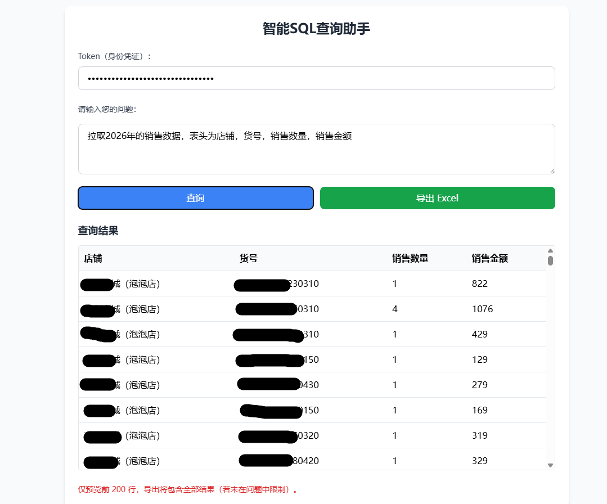

# sql2xlsx

一个基于 Flask + LangChain 的“自然语言提问 → 生成只读 SQL → 预览结果 → 导出 Excel（.xlsx）”小工具，适用于 MySQL 数据库。

## 功能

- 输入中文问题，自动生成可执行的 MySQL 查询（仅允许 `SELECT`/`WITH`）
- 预览前 200 行结果，支持表格展示
- 一键导出完整结果为 Excel（.xlsx）
- 简单鉴权：前端 Token 对应服务端 `AUTH_SECRET`
- 访问限流：`/preview`、`/export` 以及全局默认限流

## 目录结构

- `app.py`：Flask 服务（`/`、`/preview`、`/export`）
- `sql_agent.py`：调用 LLM 生成 SQL
- `config.py`：环境变量配置与校验
- `static/index.html`：内置前端页面
- `Dockerfile` / `docker-compose.yml`：容器化部署

## 环境变量

服务启动前需要配置以下环境变量（至少 4 个为必填）：

| 变量名                          |    必填 |                                         默认值 | 说明                               |
| ---------------------------- | ----: | ------------------------------------------: | -------------------------------- |
| `DB_USERNAME`                |     是 |                                           - | MySQL 用户名                        |
| `DB_PASSWORD`                |     是 |                                           - | MySQL 密码                         |
| `DB_HOST`                    |     否 | 本地运行：`localhost`；容器内：`host.docker.internal` | MySQL 主机                         |
| `DB_PORT`                    |     否 |                                      `3306` | MySQL 端口                         |
| `DATABASE`                   |     是 |                                           - | MySQL 数据库名                       |
| `AUTH_SECRET`                |     是 |                                           - | 前端 Token（身份凭证）                   |
| `MODEL_NAME`                 |     否 |                             `deepseek-chat` | 模型名（交给 LangChain 初始化）            |
| `PORT`                       |     否 |                                      `5000` | 服务端口                             |
| `DEBUG`                      |     否 |                                     `false` | Flask debug                      |
| `LOG_LEVEL`                  |     否 |                                      `INFO` | 日志级别                             |
| `DB_CONNECT_TIMEOUT_SECONDS` |     否 |                                        `10` | DB 连接超时（秒）                       |
| `QUESTION_MAX_CHARS`         |     否 |                                      `1000` | 最大问题长度                           |
| `EXPORT_ESTIMATED_ROW_LIMIT` |     否 |                                    `200000` | 导出预计行数上限（通过 `EXPLAIN` 估算）        |
| `DEEPSEEK_API_KEY`           | 视模型而定 |                                           - | LLM 提供方所需的 API Key（示例为 DeepSeek） |
| `LANGSMITH_TRACING`          |     否 |                                     `false` | LangSmith tracing                |
| `LANGSMITH_API_KEY`          |     否 |                                           - | LangSmith API Key                |

## 快速开始（Docker Compose）

1. 在项目根目录创建并填写 `.env`（示例）：

```env
DB_HOST=localhost
DB_PORT=3306
DB_USERNAME=root
DB_PASSWORD=your_password
DATABASE=your_db
AUTH_SECRET=change_me
DEEPSEEK_API_KEY=your_deepseek_key
MODEL_NAME=deepseek-chat
PORT=5000
```

1. 启动服务：

```bash
docker compose up --build -d
```

1. 打开页面：

- <http://localhost:5000/>

## 本地运行（Python）

1. 安装依赖：

```bash
python -m venv venv
source venv/bin/activate
pip install -r requirements.txt
```

1. 配置环境变量（同上 `.env`），然后启动：

```bash
python app.py
```

或使用 gunicorn（生产更推荐）：

```bash
gunicorn --bind 0.0.0.0:5000 --timeout 120 app:app
```

## 接口说明

### `POST /preview`

用于生成 SQL 并执行预览（最多 200 行）。

请求体：

```json
{
  "question": "例如：查询订单号为 126022652882480 的数据",
  "token": "与你配置的 AUTH_SECRET 一致"
}
```

响应体（成功）：

```json
{
  "ok": true,
  "query_id": "用于导出的临时 ID",
  "columns": ["col1", "col2"],
  "rows": [["v1", "v2"]],
  "preview_limit": 200,
  "truncated": false
}
```

说明：

- 生成的 SQL 会被限制为只读查询：仅允许 `SELECT`/`WITH`，且禁止分号、注释、以及常见危险关键字。
- 返回的 `query_id` 会在内存缓存中保存一段时间（默认 10 分钟），用于后续导出。

### `POST /export`

根据 `query_id` 执行完整查询并导出 Excel。

请求体：

```json
{
  "token": "与你配置的 AUTH_SECRET 一致",
  "query_id": "来自 /preview 的 query_id"
}
```

响应：

- `200 OK`，返回 `.xlsx` 文件（`Content-Disposition` 中带文件名）

## 限制与安全

- 仅支持 MySQL（SQLAlchemy URI：`mysql+mysqlconnector://...`）
- 仅允许只读 SQL；如果模型生成了非只读语句会被拒绝
- 默认限流：
  - 全局：`5 per minute`
  - `/preview`：`10 per minute`
  - `/export`：`5 per minute`

## 截图


