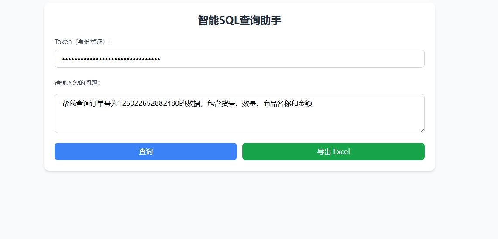
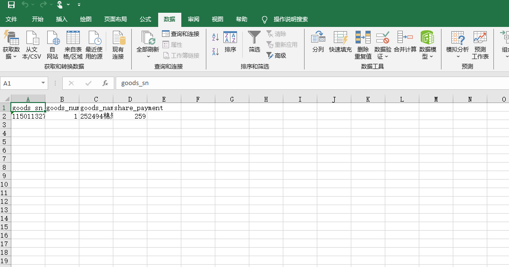

# SQL2XLSX

[](LICENSE)
[](https://python.org)

# 1.安装依赖
```
pip install -r requirements.txt
```

# 2.配置环境变量
在根目录创建`.env `文件

添加并配置以下环境变量：
```angular2html
<!--模型API KEY-->
DEEPSEEK_API_KEY=
LANGSMITH_TRACING="true"
<!--LANGSMITH_TRACING API KEY-->
LANGSMITH_API_KEY=
<!--数据库用户名-->
DB_USERNAME=
<!--数据库密码-->
DB_PASSWORD=
<!--数据库地址-->
DB_HOST=
<!--数据库端口-->
DB_PORT=
<!--数据库名-->
DATABASE=
<--简易的身份验证密钥-->
AUTH_SECRET=  
```

# 3.数据库配置
自行配置数据库，默认为MSQL，可改用其他数据库，数据自行导入

# 4.启动应用
```
python app.py
```

# 5.使用截图

